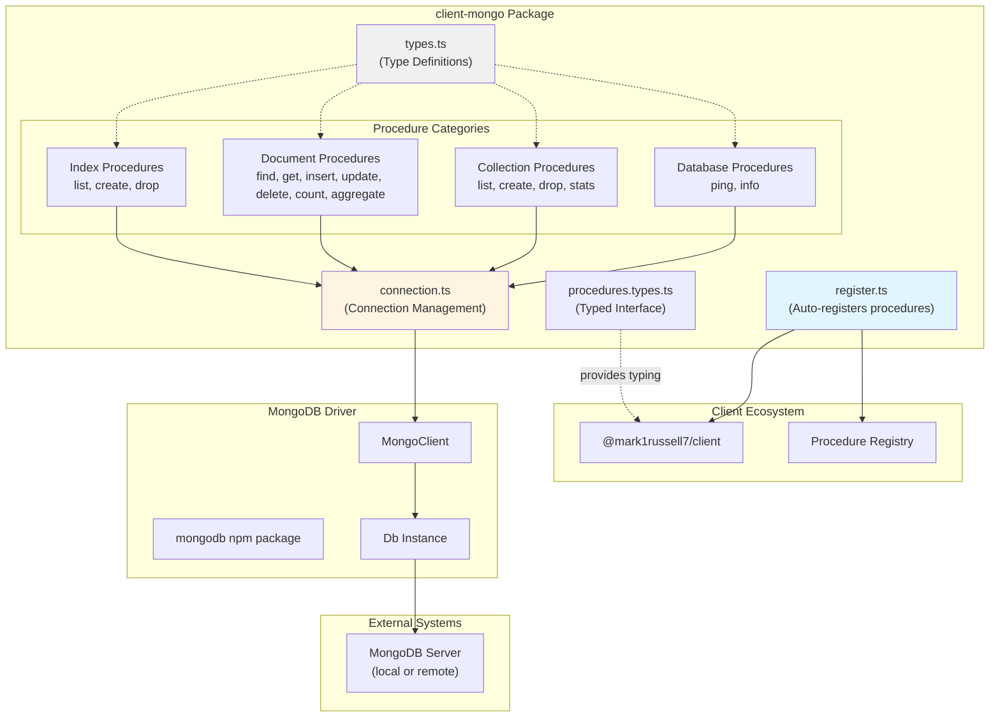
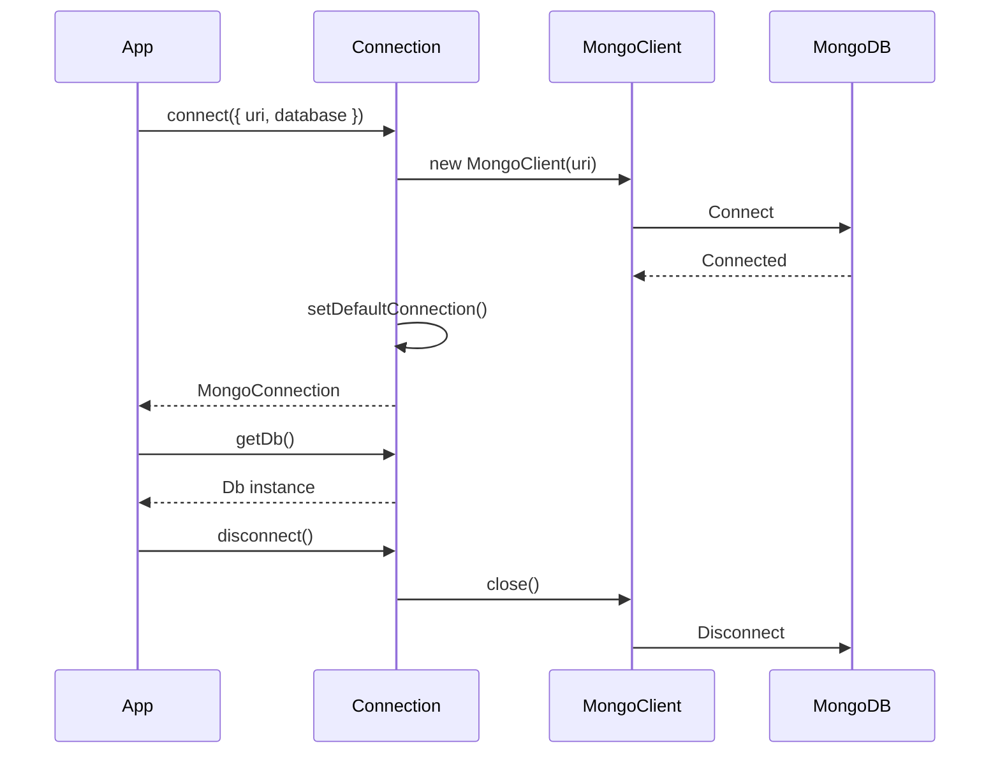

# @mark1russell7/client-mongo

[](https://www.npmjs.com/package/@mark1russell7/client-mongo)
[](https://opensource.org/licenses/MIT)
[](https://www.typescriptlang.org/)
[](https://nodejs.org/)

MongoDB client wrapper with client procedures for local or RPC access. Provides a comprehensive set of procedures for database operations, collection management, document CRUD, indexing, and aggregation pipeline support.

## Overview

`client-mongo` bridges MongoDB operations into the client procedure ecosystem, enabling both:
- **Local usage**: Direct MongoDB connection with native driver
- **RPC usage**: Remote procedure calls via `client.call()`

The package follows the client procedure pattern, auto-registering 16 procedures organized into 4 categories:
- **Database**: `ping`, `info`
- **Collections**: `list`, `create`, `drop`, `stats`
- **Documents**: `find`, `get`, `insert`, `update`, `delete`, `count`, `aggregate`
- **Indexes**: `list`, `create`, `drop`

## Architecture



### Package Dependency Flow

```mermaid
graph LR
    App["Your Application"]
    ClientMongo["@mark1russell7/client-mongo"]
    Client["@mark1russell7/client"]
    MongoDB["mongodb"]

    App --> ClientMongo
    ClientMongo --> Client
    ClientMongo --> MongoDB

    App -.client.call.-> Client
    Client -.executes.-> ClientMongo
    ClientMongo -.queries.-> MongoDB
```

### Connection Management Flow



## Installation

```bash
npm install @mark1russell7/client-mongo
```

### Peer Dependencies

```json
{
  "@mark1russell7/client": "github:mark1russell7/client#main",
  "mongodb": "^7.0.0"
}
```

## Configuration

### Environment Variables

```bash
# MongoDB connection URI (optional, defaults to mongodb://localhost:27017)
MONGODB_URI=mongodb://localhost:27017

# Default database name (optional, defaults to "test")
MONGODB_DATABASE=myapp
```

### Programmatic Configuration

```typescript
import { connect } from "@mark1russell7/client-mongo";

// Using environment variables
await connect();

// With explicit options
await connect({
  uri: "mongodb://localhost:27017",
  database: "myapp",
  clientOptions: {
    // Any MongoDB client options
    maxPoolSize: 10,
    minPoolSize: 2,
  }
});
```

## API Reference

### Connection Management

#### `connect(options?): Promise<MongoConnection>`

Create and connect to MongoDB. Sets the default connection used by all procedures.

```typescript
interface MongoConnectionOptions {
  uri?: string;                    // Default: MONGODB_URI or mongodb://localhost:27017
  database?: string;               // Default: MONGODB_DATABASE or "test"
  clientOptions?: MongoClientOptions;
}

interface MongoConnection {
  getDb(): Db;
  getClient(): MongoClient;
  connect(): Promise<void>;
  disconnect(): Promise<void>;
  isConnected(): boolean;
}
```

**Example:**
```typescript
const conn = await connect({
  uri: "mongodb://localhost:27017",
  database: "myapp"
});
```

#### `disconnect(): Promise<void>`

Disconnect the default connection.

```typescript
await disconnect();
```

#### `getDb(): Db`

Get the database instance from the default connection.

```typescript
const db = getDb();
const collection = db.collection("users");
```

#### `getClient(): MongoClient`

Get the MongoClient from the default connection.

```typescript
const client = getClient();
```

#### `getDefaultConnection(): MongoConnection`

Get the default connection instance. Throws if not connected.

#### `setDefaultConnection(conn: MongoConnection): void`

Set the default connection (advanced usage).

#### `hasDefaultConnection(): boolean`

Check if a default connection exists.

### Registered Procedures

All procedures are automatically registered when the package is imported. They can be called via `client.call()` or used directly.

#### Database Procedures

##### `mongo.database.ping`

Test database connectivity and measure latency.

```typescript
// Via RPC
const result = await client.call(
  ["mongo", "database", "ping"],
  { timeout: 5000 }
);

// Direct import
import { pingProcedure } from "@mark1russell7/client-mongo";
```

**Input:**
```typescript
interface PingInput {
  timeout?: number;  // Optional timeout in milliseconds
}
```

**Output:**
```typescript
interface PingOutput {
  latencyMs: number;  // Response time in milliseconds
  ok: boolean;        // Server status
}
```

##### `mongo.database.info`

Get database information and statistics.

```typescript
const result = await client.call(
  ["mongo", "database", "info"],
  { includeStats: true }
);
```

**Input:**
```typescript
interface InfoInput {
  includeStats?: boolean;
}
```

**Output:**
```typescript
interface DatabaseInfo {
  name: string;         // Database name
  collections: number;  // Number of collections
  views: number;        // Number of views
  sizeOnDisk: number;   // Size on disk in bytes
  empty: boolean;       // Whether database is empty
}
```

#### Collection Procedures

##### `mongo.collections.list`

List all collections in the database.

```typescript
const result = await client.call(
  ["mongo", "collections", "list"],
  { filter: "user" }
);
```

**Input:**
```typescript
interface ListCollectionsInput {
  filter?: string;  // Filter by name pattern
}
```

**Output:**
```typescript
interface ListCollectionsOutput {
  collections: string[];  // Collection names
}
```

##### `mongo.collections.create`

Create a new collection.

```typescript
const result = await client.call(
  ["mongo", "collections", "create"],
  {
    name: "logs",
    options: {
      capped: true,
      size: 10485760,  // 10MB
      max: 1000
    }
  }
);
```

**Input:**
```typescript
interface CreateCollectionInput {
  name: string;
  options?: CollectionOptions;
}

interface CollectionOptions {
  capped?: boolean;
  size?: number;      // Max size in bytes (for capped)
  max?: number;       // Max documents (for capped)
  validator?: Document;  // JSON Schema validator
}
```

**Output:**
```typescript
interface CreateCollectionOutput {
  created: boolean;
  name: string;
}
```

##### `mongo.collections.drop`

Drop a collection.

```typescript
const result = await client.call(
  ["mongo", "collections", "drop"],
  { name: "old_collection" }
);
```

**Input:**
```typescript
interface DropCollectionInput {
  name: string;
}
```

**Output:**
```typescript
interface DropCollectionOutput {
  dropped: boolean;
}
```

##### `mongo.collections.stats`

Get collection statistics.

```typescript
const result = await client.call(
  ["mongo", "collections", "stats"],
  {},
  { metadata: { collection: "users" } }
);
```

**Input:**
```typescript
interface StatsInput {
  // Collection from metadata
}
```

**Output:**
```typescript
interface CollectionStats {
  count: number;           // Number of documents
  size: number;            // Size of documents in bytes
  avgObjSize: number;      // Average document size
  storageSize: number;     // Total storage size
  nindexes: number;        // Number of indexes
  totalIndexSize: number;  // Total index size
}
```

#### Document Procedures

##### `mongo.documents.find`

Find documents with pagination, filtering, sorting, and projection.

```typescript
const result = await client.call(
  ["mongo", "documents", "find"],
  {
    query: { status: "active", age: { $gte: 18 } },
    projection: { name: 1, email: 1 },
    sort: { createdAt: -1 },
    page: 1,
    limit: 20
  },
  { metadata: { collection: "users" } }
);
```

**Input:**
```typescript
interface FindInput {
  query?: DocumentQuery;           // MongoDB filter
  projection?: Record<string, 0 | 1>;  // Field projection
  sort?: SortSpec;                 // Sort specification
  page?: number;                   // Page number (1-indexed)
  limit?: number;                  // Items per page (max 100)
}

type DocumentQuery = Filter<Document>;
type SortSpec = Record<string, 1 | -1>;
```

**Output:**
```typescript
interface FindOutput {
  documents: MongoDocument[];
  pagination: PaginationOutput;
}

interface PaginationOutput {
  page: number;
  limit: number;
  total: number;
  totalPages: number;
  hasNext: boolean;
  hasPrev: boolean;
}
```

##### `mongo.documents.get`

Get a single document by ID.

```typescript
const result = await client.call(
  ["mongo", "documents", "get"],
  { id: "507f1f77bcf86cd799439011" },
  { metadata: { collection: "users" } }
);
```

**Input:**
```typescript
interface GetInput {
  id: string;  // Document ID (converted to ObjectId)
}
```

**Output:**
```typescript
interface GetOutput {
  document: MongoDocument | null;
}
```

##### `mongo.documents.insert`

Insert one or more documents.

```typescript
// Insert single document
const result = await client.call(
  ["mongo", "documents", "insert"],
  {
    documents: {
      name: "John Doe",
      email: "john@example.com",
      createdAt: new Date()
    }
  },
  { metadata: { collection: "users" } }
);

// Insert multiple documents
const result = await client.call(
  ["mongo", "documents", "insert"],
  {
    documents: [
      { name: "Alice" },
      { name: "Bob" }
    ]
  },
  { metadata: { collection: "users" } }
);
```

**Input:**
```typescript
interface InsertInput {
  documents: MongoDocument | MongoDocument[];
}
```

**Output:**
```typescript
interface InsertOutput {
  insertedCount: number;
  insertedIds: string[];
}
```

##### `mongo.documents.update`

Update documents matching a query.

```typescript
// Update single document
const result = await client.call(
  ["mongo", "documents", "update"],
  {
    query: { _id: "..." },
    update: { $set: { status: "inactive" } },
    upsert: false
  },
  { metadata: { collection: "users" } }
);

// Update multiple documents
const result = await client.call(
  ["mongo", "documents", "update"],
  {
    query: { status: "pending" },
    update: { $set: { status: "active" } },
    multi: true
  },
  { metadata: { collection: "users" } }
);
```

**Input:**
```typescript
interface UpdateInput {
  query: DocumentQuery;
  update: DocumentUpdate;
  multi?: boolean;   // Update all matching documents
  upsert?: boolean;  // Insert if not found
}

type DocumentUpdate = UpdateFilter<Document>;
```

**Output:**
```typescript
interface UpdateOutput {
  matchedCount: number;
  modifiedCount: number;
  upsertedId?: string;
}
```

##### `mongo.documents.delete`

Delete documents matching a query.

```typescript
// Delete single document
const result = await client.call(
  ["mongo", "documents", "delete"],
  {
    query: { _id: "..." }
  },
  { metadata: { collection: "users" } }
);

// Delete multiple documents
const result = await client.call(
  ["mongo", "documents", "delete"],
  {
    query: { status: "inactive" },
    multi: true
  },
  { metadata: { collection: "users" } }
);
```

**Input:**
```typescript
interface DeleteInput {
  query: DocumentQuery;
  multi?: boolean;  // Delete all matching documents
}
```

**Output:**
```typescript
interface DeleteOutput {
  deletedCount: number;
}
```

##### `mongo.documents.count`

Count documents matching a query.

```typescript
const result = await client.call(
  ["mongo", "documents", "count"],
  { query: { status: "active" } },
  { metadata: { collection: "users" } }
);
```

**Input:**
```typescript
interface CountInput {
  query?: DocumentQuery;
}
```

**Output:**
```typescript
interface CountOutput {
  count: number;
}
```

##### `mongo.documents.aggregate`

Execute an aggregation pipeline.

```typescript
const result = await client.call(
  ["mongo", "documents", "aggregate"],
  {
    pipeline: [
      { $match: { status: "active" } },
      { $group: { _id: "$country", count: { $sum: 1 } } },
      { $sort: { count: -1 } }
    ],
    options: {
      allowDiskUse: true,
      maxTimeMS: 5000
    }
  },
  { metadata: { collection: "users" } }
);
```

**Input:**
```typescript
interface AggregateInput {
  pipeline: AggregationStage[];
  options?: AggregationOptions;
}

type AggregationStage = Document;

interface AggregationOptions {
  allowDiskUse?: boolean;
  maxTimeMS?: number;
}
```

**Output:**
```typescript
interface AggregateOutput {
  results: MongoDocument[];
}
```

#### Index Procedures

##### `mongo.indexes.list`

List all indexes on a collection.

```typescript
const result = await client.call(
  ["mongo", "indexes", "list"],
  {},
  { metadata: { collection: "users" } }
);
```

**Input:**
```typescript
interface ListIndexesInput {
  // Collection from metadata
}
```

**Output:**
```typescript
interface ListIndexesOutput {
  indexes: IndexInfo[];
}

interface IndexInfo {
  name: string;
  key: IndexSpec;
  unique?: boolean;
  sparse?: boolean;
}

type IndexSpec = Record<string, 1 | -1 | "text" | "2dsphere">;
```

##### `mongo.indexes.create`

Create an index on a collection.

```typescript
// Simple index
const result = await client.call(
  ["mongo", "indexes", "create"],
  {
    keys: { email: 1 },
    options: { unique: true }
  },
  { metadata: { collection: "users" } }
);

// Compound index
const result = await client.call(
  ["mongo", "indexes", "create"],
  {
    keys: { status: 1, createdAt: -1 },
    options: { name: "status_created_idx" }
  },
  { metadata: { collection: "users" } }
);

// Text index
const result = await client.call(
  ["mongo", "indexes", "create"],
  {
    keys: { title: "text", description: "text" }
  },
  { metadata: { collection: "articles" } }
);
```

**Input:**
```typescript
interface CreateIndexInput {
  keys: IndexSpec;
  options?: IndexOptions;
}

interface IndexOptions {
  name?: string;
  unique?: boolean;
  sparse?: boolean;
  background?: boolean;
  expireAfterSeconds?: number;  // TTL index
}
```

**Output:**
```typescript
interface CreateIndexOutput {
  name: string;  // Index name
}
```

##### `mongo.indexes.drop`

Drop an index from a collection.

```typescript
const result = await client.call(
  ["mongo", "indexes", "drop"],
  { name: "email_1" },
  { metadata: { collection: "users" } }
);
```

**Input:**
```typescript
interface DropIndexInput {
  name: string;  // Index name to drop
}
```

**Output:**
```typescript
interface DropIndexOutput {
  dropped: boolean;
}
```

### Type Definitions

#### Core Types

```typescript
// Documents
type DocumentId = string | ObjectId;
type BaseDocument = Document;
type MongoDocument = BaseDocument;
type DocumentQuery = Filter<Document>;
type DocumentUpdate = UpdateFilter<Document>;

// Metadata
interface BaseMeta extends Record<string, unknown> {
  database?: string;  // Override database name
}

interface CollectionMeta extends BaseMeta {
  collection: string;  // Collection name (required)
}

// Pagination
interface PaginationInput {
  page?: number;   // Page number (1-indexed)
  limit?: number;  // Items per page
}

interface PaginationOutput {
  page: number;
  limit: number;
  total: number;
  totalPages: number;
  hasNext: boolean;
  hasPrev: boolean;
}

// Sorting
type SortOrder = 1 | -1;
type SortSpec = Record<string, SortOrder>;

// Indexes
type IndexSpec = Record<string, 1 | -1 | "text" | "2dsphere">;

interface IndexOptions {
  name?: string;
  unique?: boolean;
  sparse?: boolean;
  background?: boolean;
  expireAfterSeconds?: number;
}

interface IndexInfo {
  name: string;
  key: IndexSpec;
  unique?: boolean;
  sparse?: boolean;
}

// Collections
interface CollectionOptions {
  capped?: boolean;
  size?: number;
  max?: number;
  validator?: Document;
}

interface CollectionStats {
  count: number;
  size: number;
  avgObjSize: number;
  storageSize: number;
  nindexes: number;
  totalIndexSize: number;
}

// Database
interface DatabaseInfo {
  name: string;
  collections: number;
  views: number;
  sizeOnDisk: number;
  empty: boolean;
}

// Aggregation
type AggregationStage = Document;

interface AggregationOptions {
  allowDiskUse?: boolean;
  maxTimeMS?: number;
}

// Bulk Operations
interface BulkInsertOne {
  insertOne: { document: Document };
}

interface BulkUpdateOne {
  updateOne: {
    filter: DocumentQuery;
    update: DocumentUpdate;
    upsert?: boolean;
  };
}

interface BulkDeleteOne {
  deleteOne: { filter: DocumentQuery };
}

type BulkOperation = BulkInsertOne | BulkUpdateOne | BulkDeleteOne;

interface BulkWriteResult {
  acknowledged: boolean;
  insertedCount: number;
  matchedCount: number;
  modifiedCount: number;
  deletedCount: number;
  upsertedCount: number;
}
```

#### Typed Procedures Interface

For compile-time autocomplete, use the `MongoProcedures` type:

```typescript
import type { MongoProcedures } from "@mark1russell7/client-mongo";
import { createTypedCaller } from "@mark1russell7/client";

const call = createTypedCaller<MongoProcedures>(client.call);

// Full autocomplete on path and input!
const result = await call(
  ["mongo", "documents", "find"],
  { query: { status: "active" } },
  { metadata: { collection: "users" } }
);
// result is typed as FindOutput
```

### Type Guards and Utilities

```typescript
// Check if metadata has collection
function hasCollection(metadata: Record<string, unknown>): metadata is CollectionMeta;

// Get collection metadata, throws if missing
function requireCollection(metadata: Record<string, unknown>): CollectionMeta;

// Get base metadata (database override)
function getBaseMeta(metadata: Record<string, unknown>): BaseMeta;
```

## Usage Examples

### Basic CRUD Operations

```typescript
import { Client } from "@mark1russell7/client";
import { connect } from "@mark1russell7/client-mongo";

// Connect to MongoDB
await connect({
  uri: "mongodb://localhost:27017",
  database: "myapp"
});

const client = new Client(/* config */);

// Create a user
const insertResult = await client.call(
  ["mongo", "documents", "insert"],
  {
    documents: {
      name: "Alice Johnson",
      email: "alice@example.com",
      age: 28,
      status: "active",
      createdAt: new Date()
    }
  },
  { metadata: { collection: "users" } }
);

// Find active users
const findResult = await client.call(
  ["mongo", "documents", "find"],
  {
    query: { status: "active" },
    sort: { createdAt: -1 },
    limit: 10
  },
  { metadata: { collection: "users" } }
);

console.log(findResult.documents);
console.log(findResult.pagination);

// Update a user
await client.call(
  ["mongo", "documents", "update"],
  {
    query: { email: "alice@example.com" },
    update: { $set: { status: "inactive" } }
  },
  { metadata: { collection: "users" } }
);

// Delete inactive users
await client.call(
  ["mongo", "documents", "delete"],
  {
    query: { status: "inactive" },
    multi: true
  },
  { metadata: { collection: "users" } }
);
```

### Aggregation Pipeline

```typescript
// Group users by country and count
const result = await client.call(
  ["mongo", "documents", "aggregate"],
  {
    pipeline: [
      { $match: { status: "active" } },
      { $group: {
          _id: "$country",
          count: { $sum: 1 },
          avgAge: { $avg: "$age" }
        }
      },
      { $sort: { count: -1 } },
      { $limit: 10 }
    ]
  },
  { metadata: { collection: "users" } }
);

console.log(result.results);
```

### Index Management

```typescript
// Create unique email index
await client.call(
  ["mongo", "indexes", "create"],
  {
    keys: { email: 1 },
    options: { unique: true, name: "email_unique_idx" }
  },
  { metadata: { collection: "users" } }
);

// Create compound index
await client.call(
  ["mongo", "indexes", "create"],
  {
    keys: { status: 1, createdAt: -1 },
    options: { name: "status_created_idx" }
  },
  { metadata: { collection: "users" } }
);

// List all indexes
const indexes = await client.call(
  ["mongo", "indexes", "list"],
  {},
  { metadata: { collection: "users" } }
);

console.log(indexes.indexes);

// Drop an index
await client.call(
  ["mongo", "indexes", "drop"],
  { name: "status_created_idx" },
  { metadata: { collection: "users" } }
);
```

### Collection Management

```typescript
// Create capped collection for logs
await client.call(
  ["mongo", "collections", "create"],
  {
    name: "logs",
    options: {
      capped: true,
      size: 10485760,  // 10MB
      max: 1000
    }
  }
);

// List all collections
const collections = await client.call(
  ["mongo", "collections", "list"],
  { filter: "user" }  // Filter collections containing "user"
);

console.log(collections.collections);

// Get collection stats
const stats = await client.call(
  ["mongo", "collections", "stats"],
  {},
  { metadata: { collection: "users" } }
);

console.log(stats);
```

### Direct Usage (Without RPC)

```typescript
import {
  connect,
  findProcedure,
  insertProcedure,
  requireCollection
} from "@mark1russell7/client-mongo";

await connect({ database: "myapp" });

// Use procedures directly
const findResult = await findProcedure.handler(
  { query: { status: "active" }, limit: 10 },
  { metadata: { collection: "users" } }
);

const insertResult = await insertProcedure.handler(
  { documents: { name: "Bob", email: "bob@example.com" } },
  { metadata: { collection: "users" } }
);
```

### Multi-Database Support

```typescript
// Default database
await client.call(
  ["mongo", "documents", "find"],
  { query: {} },
  { metadata: { collection: "users" } }
);

// Override database in metadata
await client.call(
  ["mongo", "documents", "find"],
  { query: {} },
  { metadata: { database: "analytics", collection: "events" } }
);
```

## Integration with Ecosystem

### Bundle Packages

`client-mongo` can be included in bundle packages:

```typescript
// In bundle-data/src/register.ts
import "@mark1russell7/client-mongo/register.js";
import "@mark1russell7/client-sqlite/register.js";
import "@mark1russell7/client-s3/register.js";
```

### Type-Safe Calling

```typescript
import type { MongoProcedures } from "@mark1russell7/client-mongo";

type AllProcedures = MongoProcedures & OtherProcedures;

const call = createTypedCaller<AllProcedures>(client.call);
```

## Dependencies

### Runtime Dependencies

- **@mark1russell7/client** - Core client procedure system
- **mongodb** (^7.0.0) - Official MongoDB Node.js driver

### Development Dependencies

- **@mark1russell7/cue** - Configuration and type utilities
- **typescript** (^5.9.3) - TypeScript compiler
- **@types/node** (^22.0.0) - Node.js type definitions

## Package Structure

```
client-mongo/
├── src/
│   ├── connection.ts           # Connection management
│   ├── types.ts                # Core type definitions
│   ├── procedures.types.ts     # Typed procedures interface
│   ├── register.ts             # Auto-registration
│   ├── index.ts                # Main entry point
│   ├── procedures/
│   │   ├── schema.ts           # Minimal schema helpers
│   │   ├── index.ts            # Procedure barrel export
│   │   ├── database.ping.ts
│   │   ├── database.info.ts
│   │   ├── collections.list.ts
│   │   ├── collections.create.ts
│   │   ├── collections.drop.ts
│   │   ├── collections.stats.ts
│   │   ├── documents.find.ts
│   │   ├── documents.get.ts
│   │   ├── documents.insert.ts
│   │   ├── documents.update.ts
│   │   ├── documents.delete.ts
│   │   ├── documents.count.ts
│   │   ├── documents.aggregate.ts
│   │   ├── indexes.list.ts
│   │   ├── indexes.create.ts
│   │   └── indexes.drop.ts
├── dist/                       # Compiled output
├── package.json
├── tsconfig.json
└── README.md
```

## Development

### Build

```bash
npm run build
```

### Type Check

```bash
npm run typecheck
```

### Clean

```bash
npm run clean
```

## License

MIT

## Author

Mark Russell <marktheprogrammer17@gmail.com>

## Repository

https://github.com/mark1russell7/client-mongo
